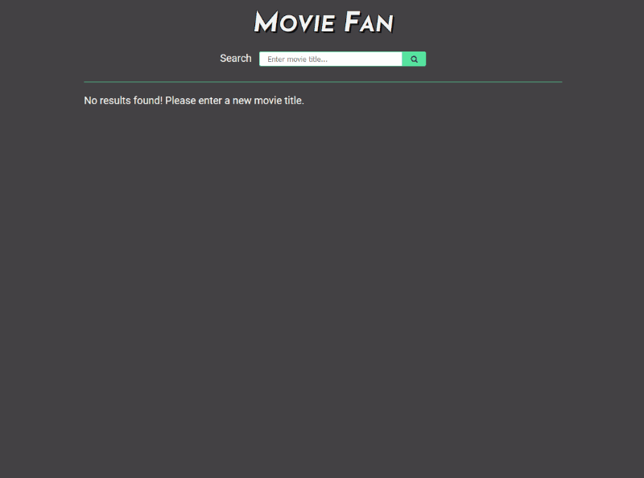

# Movie Fan
This app allows a user to search for movies and see their details using [The Open Movie Database API](http://www.omdbapi.com/). A user can also add Upvotes/Downvotes to a movie, which is stored on a database for all to see.

[Live Site](https://movie-fan.netlify.app/)

# Tech Stack

* Frontend
  * React & hooks
  * Axios
  * Hosted on Netlify (free tier)
* Backend
  * Node.js
  * Express
  * Axios
  * MongoDB & Mongoose
  * Server hosted on Heroku (free tier)
  * DB hosted on MongoDB Atlas (free tier)

# Client Setup
1.  Install [Node.js and npm](https://www.npmjs.com/get-npm)
2.  Install project dependencies:
    1. Navigate to the `/client` directory
    2. Run command:
        ```bash
        npm install
        ```
3. Run the development server:
    1.  Navigate to the `/client` directory
    2.  Run command:
        ```bash
        npm start
        ```
4. Client should now be hosted on `localhost:3000`

# Preview


# Todos / Wishlist
### Add error handling to the client
- The app currently assumes that all API calls will be successful. I would like to add error handling for server errors and communicate that to the user.

### Create a responsive layout for mobile
- The app is currently only designed for desktop and the movie details page is not very mobile friendly.

### Pagination of search results
- Right now the app only returns the first 10 search results from the OMDB API. The API has support for pages, so I would like to utilize pagination and allow the user to browse more search results.

### Client and Server tests
- Currently there are no written tests. At the very least, I would like to have render and snapshot tests for my frontend components and some route tests for my backend.